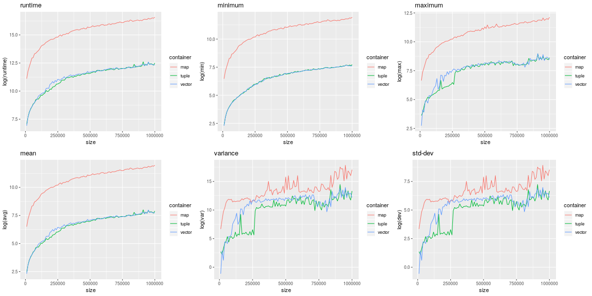
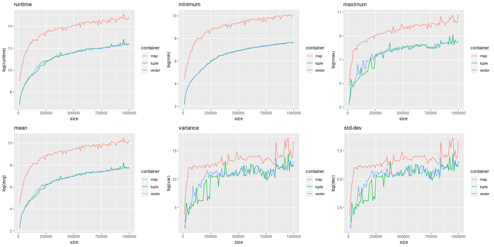

# tuple_vector

A specialised container class based on std::vector containing std::pair<K,V> tuples for
*fast* find(K) and lower_bound(K) operations on timeseries data with strictly increasing
keys. It can be used like a normal std::vector (since it is one), with the addition of
some std::map methods: find(key), lower_bound(key), at(key), operator.

# Use-cases

The typical use-case is to read strictly increasing timeseries data once, e.g. from a
database or data provider api, and then only append to it.
The performance for appending, array operations and iterations is in the same ballpark as
std::vector, while the find() and lower_bound() performance is typically 10x and 5x faster
than std::map, but this also depends somewhat on the type of key being used - ymmv.

# Operation

The find() and lower_bound() methods piggyback on the properties of strictly increasing
timeseries data by implementing an interpolation search with ~O(log log n) complexity.

# Sample

See the provided sample.cc or perf.cc files for usage examples. To compile the provided
sample programs, you will also need to clone my ``cppbench`` repository.

# Performance plots

These performance plots were generated by first running the sample ``perf`` program to 
collect the runtime performance for various container operations and then calling the
provided ``mkplots.r`` utility (needs R).

## emplace performance comparison between vector, map and tuple_vector
")

## operator[] performance comparison between vector, map and tuple_vector

## iterator performance comparison between vector, map and tuple_vector

## find performance comparison between map and tuple_vector
")

## lower_bound performance comparison between map and tuple_vector
")

